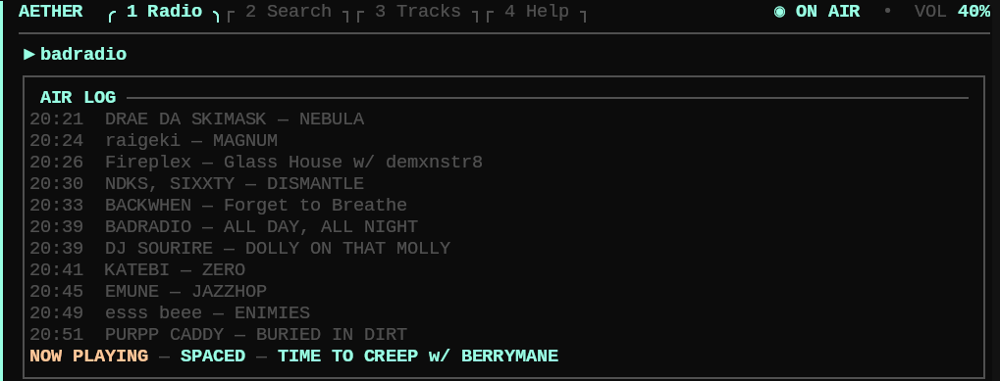

<p align="center">
  
</p>

# Aether

Минимальный TUI-плеер радиостанций на Go + Bubble Tea + mpv.



## Возможности

- TUI-интерфейс для интернет-радио.
- Воспроизведение через `mpv` и IPC без лишних рестартов процесса.
- Поиск станций через Radio Browser.
- История треков с лимитом хранения.
- Избранные станции и отдельное избранное для треков.
- Desktop notifications через `notify-send`.
- Диагностика окружения через `aether doctor`.

## Зависимости

На Arch/CachyOS:

```bash
sudo pacman -S --needed go mpv mpv-mpris
```

`mpv-mpris` опционален, но полезен для desktop/media-key интеграции.

Для копирования треков в буфер обмена нужен один из инструментов:

```bash
wl-copy
xclip
xsel
```

## Запуск

```bash
go run ./cmd/aether
```

Или установить команду в `~/go/bin`:

```bash
make install
aether
```

## Makefile

```bash
make run      # Start TUI via go run
make doctor   # Run diagnostics
make test     # Run tests
make build    # Build ./bin/aether
make install  # Install aether into Go bin dir
make clean    # Remove ./bin
```

## CLI

```bash
aether                    # Start TUI
aether doctor             # Run diagnostics
aether config path        # Print stations config path
aether config app-path    # Print app config path
aether history path       # Print history JSONL path
aether history list 20    # Print recent history
aether favorites path     # Print favorite tracks JSONL path
aether favorites list     # Print favorite tracks
aether search phonk       # Search stations via Radio Browser
aether version            # Print version
```

## Поиск станций

В TUI нажми `/`, чтобы открыть поиск станций.

Search работает в одном режиме:

- обычный текст — ввод запроса;
- `Enter` — искать / предпрослушать выбранный результат;
- `↑/↓` — выбрать результат;
- `←/→` — страницы;
- `Tab` — добавить выбранную станцию;
- `Ctrl+C` — закрыть поиск.

## Конфиги

При первом запуске создаются:

```text
~/.config/aether/stations.toml
~/.config/aether/config.toml
```

`stations.toml` хранит станции. При первом запуске создаётся стартовый набор: BadRadio, Lofi Radio и Radio Paradise Main Mix FLAC.

Пример станции:

```toml
[[station]]
name = "BadRadio"
url = "https://s2.radio.co/s2b2b68744/listen"
provider = "generic"
```

`provider` необязателен. Сейчас поддерживается универсальный `generic`, который берёт метаданные из `mpv` / ICY stream metadata.

`config.toml` хранит настройки приложения:

```toml
[player]
volume = 70
max_volume = 200
volume_step = 5

[search]
page_size = 8

[history]
max_entries = 200

[notifications]
enabled = true
```

Также там есть секции `ui.*` и `keys.*` для настройки вкладок и хоткеев, например:

```toml
[keys.global]
pause = [" "]
```

## История

Если поток отдаёт метаданные, треки автоматически пишутся в JSONL-файл:

```text
~/.local/share/aether/history.jsonl
```

Повтор одного и того же трека подряд не дублируется.

По умолчанию история хранит последние `200` записей:

```toml
[history]
max_entries = 200
```

При запуске Aether подчищает старые записи сверх этого лимита.

## Избранное

Есть два типа избранного:

- `F` — toggle favorite для выбранной станции. Favorite-станции получают `★` и поднимаются вверх списка.
- `B` — сохранить текущий трек в favorite tracks.

Favorite tracks хранятся тут:

```text
~/.local/share/aether/favorite_tracks.jsonl
```

Экран favorite tracks открывается клавишей `T`:

- `↑/↓` — навигация;
- `Enter` — скопировать `Artist — Title` в буфер обмена;
- `Delete` — удалить выбранный трек;
- `Ctrl+D` — удалить все треки, с подтверждением `Enter`;
- `Ctrl+C` — назад / отмена.

## Управление

- `↑/↓` — выбор станции;
- `Tab` — открыть / закрыть список станций;
- `Enter` — играть выбранную станцию;
- `Space` — пауза / продолжить;
- `/` — поиск станций;
- `+` / `-` — громкость;
- `B` — добавить текущий трек в favorite tracks;
- `F` — toggle favorite для выбранной станции;
- `T` — открыть favorite tracks;
- `R` — переименовать выбранную станцию, когда список станций открыт через `Tab`;
- `D` — удалить выбранную станцию с подтверждением, когда список станций открыт через `Tab`;
- `4` — вкладка Help;
- `Ctrl+C` — назад / выход.

## Release archive

Создать Linux amd64 tarball с готовым бинарником:

```bash
make release
```

Архив будет создан тут:

```text
dist/aether_1.0.0_linux_amd64.tar.gz
```

## Диагностика

```bash
aether doctor
```

Проверяет `mpv`, optional tools, пути конфигов, историю и favorite tracks.

## Backup-и

Перед изменением `stations.toml` Aether создаёт backup в:

```text
~/.config/aether/backups/
```

Хранятся последние `3` backup-а.

## Лицензия

MIT — см. [LICENSE](LICENSE).
